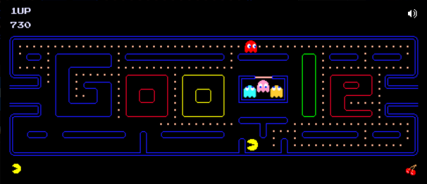

### Arch Linux 包管理工具

#### **`pacman`**

- **作用**：Arch Linux 的官方包管理器，负责安装、更新和删除软件包，并处理依赖关系。
- **来源**：名字来源于经典游戏《吃豆人》（Pac-Man)，象征“吞噬”软件包。

#### **`yay`**

- **作用**：用于管理 AUR（Arch 用户仓库）中的软件包，简化了 AUR 软件包的安装和更新过程，比手动编译更方便。
- **关系**：`yay` 主要管理 AUR 软件包，而 **`pacman`** 管理官方仓库中的软件包。

### 比较：

- **`pacman`**：管理官方仓库中的软件包。
- **`yay`**：管理 AUR 中的软件包，自动处理安装、依赖和更新，比 `pacman` 在 AUR 管理上更高效和简便。

### 互补关系：

- `yay` 和 `pacman` 是互补工具。`yay` 不会完全替代 `pacman`，但它提供了更高效的 AUR 软件包管理方式。

### 安装 `yay`：

1. **安装开发工具和 Git**：

   ```bash
   sudo pacman -S base-devel git
   ```

2. **克隆并安装 `yay`**：

   ```bash
   git clone https://aur.archlinux.org/yay.git
   cd yay
   makepkg -si
   rm -rf yay
   ```

   - `makepkg -si`：下载和编译软件，安装该软件及其所需的其他软件。

------

### 使用 `yay` 安装 AUR 软件包

```bash
yay -S <package-name>
```

- **清理缓存**：

  ```bash
  yay -Scc
  ```

- **安装 SDL2 相关包**：

  ```bash
  yay -S mingw-w64-sdl2 mingw-w64-sdl2_image mingw-w64-sdl2_gfx
  ```

  - 推荐选择 `[A]ll` 后回车进行确认。

### 删除安装的包

如果你想删除通过 `yay` 安装的这些包，可以使用以下命令：

```bash
yay -Rns mingw-w64-sdl2 mingw-w64-sdl2_image mingw-w64-sdl2_gfx
```

这条命令会执行以下操作：

- `-R`：删除指定的软件包。
- `-n`：如果该软件包没有其他包依赖它，那么会同时删除该包所依赖的非用户包。
- `-s`：删除软件包的配置文件以及不再需要的依赖项。

### 安装的库路径

- **可执行文件**：`/usr/bin/`
- **库文件**：`/usr/lib/`
- **头文件**：`/usr/include/`
- **共享资源**：`/usr/share/`

### 查找文件

```bash
find . -name "<file-name>"
```


arch入门学习

wezterm
