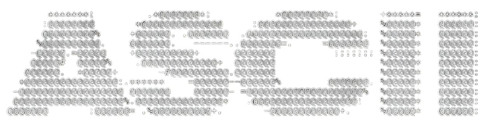

<progress value="30" max="239" style="width: 100%;">7.1%</progress>

> 9Interesting projects
>
> - [cmus](https://github.com/cmus/cmus?tab=readme-ov-file)

# A Totorial Intrduction


## Getting Started

> Every program must have a ==main== somewhere
>
> The `main` function (**clling** function) is essentially a regular function, and you can call other functions (**called** functions) within it to complete tasks.


```c
#include <stdio.h>

int main() {
    printf("Hello, World!\n");  
    return 0;  
}
```

- `stdio.h` (==st==and ==I==nput/==O==utput ==.== ==h==eader)

  > Tells the compiler to include information about the standard input/output library

  -  `stdio`

    **Libray**	-	like a **toolbox**

  - `h`

    Declatation and interface **linkage**

- `int`

  Specifies the funcation <u>return</u> an `int` **type**

- `printf` (print ==f==ormatted)

  **<u>Main</u>** calls a library function to output the result in a **predefined** format

- `\n` (==n==ew**line**)

##### Compile

`:! cc hello.c -o hello` 

- `:!` 

  Execute **<u>external</u>** command

- `cc`

  Is a **symlink** pointing to the **<u>gcc compiler</u>**

- `o` (==o==utput)


> Replenish
>
> > `:x` == `:wq`

##### Automation

Add to `init.lua`

```bash
vim.api.nvim_set_keymap('n', '<F5>', ':!gcc % -o %< && ./%< <CR>', { noremap = true, silent = true })
vim.api.nvim_set_keymap('i', '<F5>', '<Esc>:!gcc % -o %< && ./%< <CR>', { noremap = true, silent = true })
```

- `n` (==n==ormal mode)

- `%` 

  Current file name

- `%<`

  Current file name without the extension

- `noremap`

  Ensure the mapping is not recursively remapped

- `silent`

  Suppress unnecessary output during command execution

- `<Esc>:` 

  Return to **<u>normal</u>** mode


***


## Function

> Is called by naming it, followed by a parenthesized list of **arguments**


### arguments

#### `printf` 

> (print ==f==ormatted)
>
> output the result in a **predefined** format


##### \

- `\n` 	==n==ewline
- `\t`      ==t==ab
- `\\`      backslash itself
- `\'`      single quote
- `\r`      carriage return
- `\b`      ==b==ackspace

 


****


## Variables and Arithmetic Expressions

​     

### Variables


#### Declaration

> Name and a list of variables	`int a, b, c;`


|        |                                                              | 1Byte = 8bit |
| ------ | ------------------------------------------------------------ | ------------ |
| int    | **int**egers                                                 | 4            |
| short  | short integer                                                | 2            |
| long   | long interger                                                | 4/8          |
|        |                                                              |              |
| float  | **float**ing point, i.e., numbers that may have a fractional part | 4            |
| double | double-precision floating point                              | 8            |
|        |                                                              |              |
| char   | A single byte                                                | 1            |

- `long`	

  > 4 bytes on a 32-bit system, 8 bytes on a 64-bit system

- `char`

  > Store a character (typicall form the ASCLL )
  >
  >  |    0 |  A   | a    |
  >  | ---: | :--: | :--- |
  >  |   48 |  64  | 97   |

 


​	

#### %


##### d

> **decimal**
>
> If the number is **not specified**, the result will be displayed with the **<u>default width</u>.**


###### %(==number==)d

> Place the result in a field **<u>(==number==) digits wide</u>**.(**right**-justified)


###### printf

`printf("%d %d")` 

- The **space** in the middle is also print


##### f

> **floating-point**


###### Control the width and precision of the output


###### %3f 

> **Default** is ==6== digit after the decimal point

​	

###### %3.0f

> Floating-point number is to be printed at least ==3== characters wide, with no decimal point and fraction  digits.


###### %3.2f

> Printed **at least** ==6== characters wide, with ==2== digit after the decimal point


##### Omitted


###### %.2f

> Specifies ==2== characters after the decimal point, but the width is no constrained


###### %f

> Merely says to print the number as floating point(**Default** is ==6== digit after the decimal point)


##### o,x,c,%

> octal
>
> hexadecimal
>
> character
>
> itself(%) - `%d%%`


***


## Arithmetic Expressions

> If an arithmetic operator has one **<u>floating-point</u>** and one integer operand, the **<u>integer</u>** is converted to  a **<u>floating-point</u>** before the operation.


**<u>Floating-point numbers</u>** are recommended to be written as `1.0` instead of `1`

​	


***


## for

```c
for (initialization; condition; icrement){
	// loop body
}
```


***


## Symbolic Constants

`#define NAME replacement-list`


> Thereafter, any occurrence of name (not in quotes and not part of another name) will be replaced by the corresponding replacement text.

- `NAME` 

  A sequence of letters and digits that begins with a letter

  > Conventionally **==written in upper case==** so they can be readily **distinguished** from lower case variable names.

- `replacement-list`

  It's can be any sequence of characters; it is not limited to numbers.


- Notice 

   There is no semicolon(==;==) at the end of a `#define` line


***


## Character Input and Output

> **Stream** refers to a **<u>channel</u>** for **data transmission**
>
> - Text input or output, regardless of where it originates or where it goed to, is dealt with as **streams** of characters

- A ==text stream==is a sequence of characters divided into **<u>lines</u>**; echo line consists of zero or more characters followed by a **newline character**.

- All data is a bit pattern

  > What appears to be a character on the keyboard or screen is of course, like everything else, stored internally just as a bit pattern.


##### getchar & putchar

> ==Reading== or ==wirting== one character at a time.


###### getchar()

```c
char c = getchat();
```

- Reads the next input character from a **<u>text stream</u>**(normally come from the **<u>keyboard</u>**) and returns that as its value.


###### puterchar()

> Prints a character each time it is called

```c
putchar(c);
```

- Prints the contents of the integer variable c as a character, usually on the **screen**.

- Compare with `printf`

  - `putchar`

    No❎ buffer

    - Echo call **immediately** displays the character.

  - `printf` 

    Has a buffer

    - It first stores the content, and only when the conditions are met (shuch as encountering a newline character or the buffer being full)


### File Copying

```c
#include <stdio.h>

int main() {
    int c;
    while ((c = getchar()) != EOF) {
        putchar(c);
    }
    return 0;
}
```

- USE  to indicate the end of iput.

  - Only use `Ctrl+c` when **necessary**

    Such as when the porgram is **<u>stuck</u>** of you want to **<u>forcefully terminate</u>** it.

- **<u>int</u>** c;

  > `char` can be **signed**(-128 ~ 127) or **unsigned**(0 ~ 255) on different platforms, using `int` avoids conflicts with `EOF`, hold any value taht getchat returns.

- `!=` > `=` (precendence)

- `EOF`(==E==nd-==O==f-==F==ile)

  > Usually ==-1==

- Declaration & assign

  - **Simple code**, assign at declaration
  - **Complex logic**, declare first, then assign


### Character Counting

###### use while

```c
#include <stdio.h>

int main() {
    long nc = 0; //long integers are at least 32 bits.
    int c; //temporary variable
    while ((c = getchar()) != EOF) {
            ++nc;
    }
    printf("%ld\n", nc);
    return 0;
}
```

- `long nc = 0`

  Setting `nc` to 0 ensures it returns 0 for empty input

- Press  ==twice== to end the input

- `%ld` (long decimal)

  - `l`

    - Just a type modifier that indicates the data is of type `long`

    - The bit size of `long` is determined by the **system** and the **compiler**

  - `d`

    Indicates that this is a decimal integer

- `++nc` & `nc++`

  - `++nc`

    Increments the value first and then uses the incremented value

  - `nc++`

    User the value first and then increments it

  - Generally, `++c` is recommended


######  use for

```c
#include <stdio.h>

int main() {
    double nc;  
    for (nc = 0; getchar() != EOF; nc++)  
        ; //empty
        printf("%.0f\n", nc);      
    return 0;  
}
```

- `%.0f`
  - `%f` for both float and double
  - Suppresses the decimal point and the fractional part (if zero)

- The body of this `for` loop is **empty**
  - Called a **<u>null statement</u>**
  - Put it(**;**) on a separate line to make it **visible**


### Line Counting

```c
#include <stdio.h>

int main() {
    int c, nl;
    nl = 0;
    
    while ((c = getchar()) != EOF)
        if (c == '\n')
            ++nl;
    
    printf("%d\n", nl);
    
    return 0;
}
```

- `==`

  Is equal to 

  - single`=` uses for assignment


- `'\n'`

  Is a ==character constant==; in the ASCLL character set its value is **10**, the internal representation of the character \n

  - Why use `'\n'`  instead of 10
    - They all represent the same `'\n'` across different **<u>encodings</u>**
  - sigle character & string constant
    - In expressions is just an **integer**(10)
    - The string constant containing **one character**(newline character)


#### expand

Use `putchar(' ')` to output a character.(more effeicient)


### Word Counting

```c
#include <stdio.h>

#define IN 1  /* inside a word */
#define OUT 0 /* outside a word */

/* count lines, words, and characters in input */
int main() {
    int c, state, nc, nw, nl;

    state = OUT;
    nl = nw = nc = 0;

    while ((c = getchar()) != EOF) {
        ++nc;

        if (c == '\n') {
            ++nl;
        }

        if (c == ' ' || c == '\n' || c == '\t') {
            state = OUT;
        } else if (state == OUT) {
            state = IN;
            ++nw;
        }
    }

    printf("nc: %d\n", nc);  
    printf("nw: %d\n", nw);  
    printf("nl: %d\n", nl); 

    return 0;
}
```

 ##### `IN` `OUT` (Symbolic constants)

  ```c
  #define IN 1  
  #define OUT 0 
  ```

  - It improves code **readability**, especially in complex programs, making **modifications easier**.


##### `if-else`

> One and only one of the two statements associated with an `if-else` is performed

```c
if (expression)
	statement1
else
	statement2
```


##### `||` - OR

###### precedence

> `&&` > `||` 

- `&&` - AND


##### conut word

 Every time the program encounters the first character of a word, it counts one more word(`++nw`)

  ```c
  if (c == ' ' || c == '\n' || c == '\t') {
      state = OUT;
  } else if (state == OUT) {
      state = IN;
      ++nw;
  }
  ```


***


## Arrays

```c
#include <stdio.h>

/* count and output digits, whitespace, and other charactes */
int main() {
    int c, nwhite, nother;
    int ndigit[10] = {0}; // Array to count digits(0-9)

    nwhite = nother = 0; // Initialize counters

    // Read each character until EOF
    while ((c = getchar()) != EOF) {
        if (c >= '0' && c <= '9') {
            ++ndigit[c - '0']; // Increment the count for the corresponding digit
        } else if (c == ' ' || c == '\n' || c == '\t') {
            ++nwhite;
        } else {
            ++nother;
        }
    }

    // Output the results
    printf("digits =");
    for (int i = 0; i < 10; ++i) {
        printf(" %d", ndigit[i]);
    }
    printf(", white space = %d, other = %d\n", nwhite, nother);

    return 0;
}
```

- Output is similat to: `digits = 9 3 0 0 0 0 0 0 0 1, white space = 123, other = 345`


##### Declares array

```c
int ndigit[10] = {0};
```

- Declares an array of 10 integers, with `ndigit[0]` initialized to **0**, and the **other elements** automatically initialized to **0**

- Subscripts[**?**] can be integers, including variables(e.g.,`i`) and constants


###### Count digits

```c
if (c >= '0' && c <= '9') {
    ++ndigit[c - '0'];
}
```

- `c >= '0' && c <= '9'`

  > Should use a range check based on **<u>char</u>**acters(`'0'` `'9'`)

  - Precedence

    - `&&` > `||`

      > ```c
      > a || b && c   ==  a || (b && c)
      > ```

- `++ndigit[c - '0']`  

  - `c` & `'0'` are characters, and subtracting(-) give the number represented by `c`
  - 
  
    - '0' - 48
    - '1' - 49
    - '10' - 49 48(So recommended `<= 9`)
      - 'a' - 97     'z' - 122
      - 'A' - 65     'Z' - 90
    - All character ranges: `32` - `126` (' ' - '~')
  
  - Chars are essentially **small integers**
  
    > Therefore, they can be treated as integers in **<u>arithmetic operations</u>**

 

##### if - else if - else

```c
if (condition1)
    statement1
else if (condition2)
    statement2
...
else
    statementn
```

- To express a multi-way decision


##### Local Variable

```c
for (int i = 0; i < /* ending condition */; ++i) {
    
 }
```

- `int i = 0`

  > Restrict variables scope to the minimum required

- `++i` - Recommended style


##### Expansion


###### explicit type casting

```c
printf("%c \n", i);  => printf("%c \n", (char)i);
```

- Recommended - `(char)i`


***


## Functions

> Encapsulate computation, making code easier to understand and more efficient without needing to worry about implementation details.


```c
#include <stdio.h>

// Function declatation
int power(int base, int n);

// Test the power Function
int main()
{
  // Loop from 0 to 9, calculate 2^i and (-3)^i for each i
  for (int i = 0; i < 10; ++i) {
    printf("%d %d %d\n", i, power(2, i),power(-3, i));
  }
  return 0;
}

/* power: raises base to the power of n, where n >= 0 */
int power(int base, int n)
{
  int p = 1;

  for (int i = 1; i <= n; ++i) { // n = 0 -> 9
    p = p * base;
  }

  return p; // When the incoming i = 0, p = 1 is returned directly
}
```


##### Funcion prototype

> Defines a function's name, return type, and parameters, enabling early calls and type checking

```c
return_type function_name(parameter_type1, parameter_type2, ...); // prototype

int add(int a, int b){ //Definition
	return a + b;
}
```

- Pay attention to this `return_type`


###### Argument

- Formal Arguments

  > ```c
  > void add(int x, int y){ .. }
  > ```
  >
  > - `x` & `y` 
  >   - They are **placeholders** for the values the function will receive	

- Actual Arguments

  >```c
  >add(a, b);
  >```
  >
  >- `a` & `b`
  >  - **Values** or **variables** passed to the function
  >  - Assigned to the <u>**formal parameters**</u>


##### Call

```c
printf("%d %d %d\n", i, power(2,i), power(-3,i));
```

- `power(-3, i)`
  - Two arguments are provided
  - Treated as an **int**eger


##### return

- Purpose
  - Sends a value back to the caller
- In `main` - typically sent to the operating system
  - Reurn value 0
    - Indicates normal grogram termination
  - Non-zero return value
    - Signals an error or abnormal termination


##### Expansion - `scanf`(scan formatted)

```c
scanf("format_string", &variable1, &variable2,..)
```

- `"format_string"` (e.g., `"%d"`)
  - Specifies the expected input type and format
- `&variable`
  - The **<u>address of</u>**(&) the variable where the input will be stored

​	

****


## Arguments - Call by Value

> The value passed to the function is just a **temporary** ==copy== of the original value, and they do not affect each other.

- Parameters as local variables

​	

```c
int power(int base, int n)
{
  int p;
  for (p = 1; n > 0; --n) {// i initialized to 1 here
    p *= base;
  }
  return p;
}
```

- ` for (p = 1; n > 0; --n){}` 
  - `n` 
    - Counted down until it becomes 0
    - Temporary variables(not affect the original)


***


## Character Arrays

> Exercise 1−16. Revise the main routine of the longest−line program so it will correctly print the length of arbitrary long input lines, and as much as possible of the text.
>
> 
>
>  Exercise 1−17. Write a program to print all input lines that are longer than 80 characters. The C programming Language 1.8 Arguments − Call by Value 32 
>
> 
>
> Exercise 1−18. Write a program to remove trailing blanks and tabs from each line of input, and to delete entirely blank lines. 
>
> 
>
> Exercise 1−19. Write a function reverse(s) that reverses the character string s. Use it to write a program that reverses its input a line at a time.

### Code

```c
#include <stdio.h>

#define MAX_LINE_LENGTH 1000 /* maximum iput line length */

/*Function prototypes */
/* read_line reads each line, and if it's the longest, copy_string saves it. */
int read_line(char line[], int max_length);
void copy_string(char destination[], const char source[]);

/* Print the longest input lien */
int main()
{
  int current_length;
  int max_length = 0; /* maximum length seen so far */
  char current_line[MAX_LINE_LENGTH];
  char longest_line[MAX_LINE_LENGTH];
  
  /* Read lines and find the longest one */
  while ((current_length = read_line(current_line, MAX_LINE_LENGTH)) > 0) {
    if (current_length > max_length) {
      max_length = current_length;
      copy_string(longest_line, current_line);
    }
  }

  /* Print the longest line if there was one */
  if (max_length > 0) {
    printf("\n%s", longest_line);
  }

  return 0;
} 

/* Read one line into s, return the length */
/* To read multiple lines, call it multiple times */
int read_line(char s[], int max_length)
{
  int c, i;
  
  for (i = 0; i < max_length -1 && (c = getchar()) != EOF && c != '\n'; ++i)
  {
    s[i] = c; // Store the character
  }

  if (c == '\n') {
    s[i] = c;
    ++i;
  }
  s[i] = '\0'; // Add the null terminator
    
// Number of characters read (excluding \0, Arrays start at 0, counting start at 1)
  return i; 
}

/* copy_string: Copy 'source' into 'destination'; assume destination is big enouht */
void copy_string(char destination[], const char source[])
{
  int i = 0;

  /* Copy each character from 'source' to 'destination' */
  while ((destination[i] = source[i]) != '\0') {
    ++i;
  }
}
```

###### main

- `void copy_string(char destination[], const char source[]);`

  - `char destination`
    - The 'box' doesn't know its size; you can only know it by looking at the **<u>card</u>** next to it.
      - **<u>card</u>** - The passed value

  - `const`

    The passed paranmeter is ==read-only==, preventing modification.
    
  - array

    - When an array (only constant arrays) is passed to a function, it is automatically converted into a pointer to its first element. Therefore, what the function receives is actually the address of the array, not the entire array.

- `while ((current_length = read_line(current_line, MAX_LINE_LENGTH)) > 0)`

  - `readline` assigns the line length to `current_length` and check if it's greater(>) than 0
    - `\n` has length 1
    - `current_line` 
      - Used to store the input content read by `readline`


###### read_line

```c
/* Read one line into s, return the length */
/* To read multiple lines, call it multiple times */
int read_line(char s[], int max_length)
{
  int c, i;
  
  for (i = 0; i < max_length -1 && (c = getchar()) != EOF && c != '\n'; ++i)
  {
    s[i] = c; // Store the character
  }

  if (c == '\n') {
    s[i] = c;
    ++i;
  }
  s[i] = '\0'; // Add the null terminator
    
// Number of characters read (excluding \0, Arrays start at 0, counting start at 1)
  return i; 
}
```


- `int read_line(char s[], int max_length)`

  - `int` 

    It the default returen type, it could be **omitted**

  - `s` & `max_length` 

    Represents the passed value, increasing the function's **versatility**

- `for (i = 0; i < max_length -1 && (c = getchar()) != EOF && c != '\n'; ++i)`

  - If ==any== condition is not met, the loop exits

  - `i < max_length - 1`

    - `<`

      - `i` starts from **0**

    - `max_length - 1`

      Ensure there is space at the end of the array to store `\0`


######   copy_string

```c
void copy_string(char destination[], const char source[])
{
  int i = 0;

  /* Copy each character from 'source' to 'destination' */
  while ((destination[i] = source[i]) != '\0') { 
    ++i;
  }
}
```

- `while ((destination[i] = source[i]) != '\0')`
  - Copy the characters first, then ensure `\0` is copied correctly


### Expand


##### `malloc` 

> Memory Allocation

- `pointer_type *ptr = (pointer_typer *) malloc(num_elements * sizeof(element_type))`

  > ```c
  > int *ptr = (int *) malloc(10 * sizeof(int));
  > ```
  
  - `int *ptr`
    
    - It declares a pointer variable `ptr` that will store a memory address pointing to an `int` type variable
    
  - `(int *)`
  
    - `malloc` only cares about how much memory you need, and it doesn't know the date type. It is responsible for allocating a memory block. You can cast the returned `void *` to an appropriate type point (e.g., `int *`) and then use it
  
      - Pointer
  
        Is a variable that stores the **address** of another variable
  
  - `sizeof(int)`
  
    - Calculate the memory size of an `int`(Usually 4 bytes)
      - Allow the program to automatically adapt to the size of the `int` type on the current platform
  
- `free(ptr);`

  - `free`

    To release dynamically allocated memory and prevent menory **<u>leak</u>**s.

    - **leak**

      Like water leaking out of a <u>broken pipe</u>, this is a mismanagement of resources, not simply a shortage of resources.

###### e.g.

```c
#include <stdio.h>
#include <stdlib.h>

int main()
{
  int num = 10;
  // Dynamically allocate memory for 10 integers
  int *ptr = (int *)malloc(num * sizeof(int));

  // Check if malloc succeeded 
  if (ptr == NULL) {
    printf("Memory allocation failed!\n");
    return 1;
  }

  for (int i = 0; i < num; ++i) {
    ptr[i] = i;
  }

  //Print the ptr content
  for (int i = 0; i < num; ++i) {
    printf("%d", ptr[i]);
  }

  // Free the allocated memory once done 
  free(ptr);

  return 0;
}
```


##### `realloc`

> Reallocation

- pointer_type *ptr (pointer_typer *) ==realloc==(==void *ptr==, num_elements * sizeof(element_type))

  > ```c
  > int num = 10;
  > int *temp = (int *)realloc(ptr, num * sizeof(int));
  > if (temp == NULL) {
  >     printf("Memory reallocation failed!\n");
  >     free(arr);
  >     return 1;
  > }
  > arr = temp;
  > ```
  >
  > - realloc(==ptr,== num * sizeof(int))


：当 `realloc` 失败时，**原来的内容不会消失**，但是为了防止内存泄漏，必须释放原内存。

，在 `realloc` 失败时，必须使用 `free(arr)` 来释放原内存，防止内存泄漏。

##### Dangling pointer

> Like holding an expired key that points to a room that no longer exists. 
>
> - Continuing to use it may lead to errors or problems


##### **leak**

> Like water leaking out of a <u>broken pipe</u>, this is a mismanagement of resources, not simply a shortage of resources.
