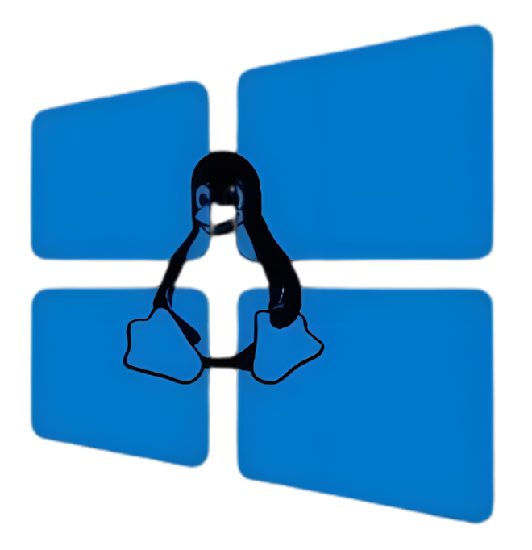
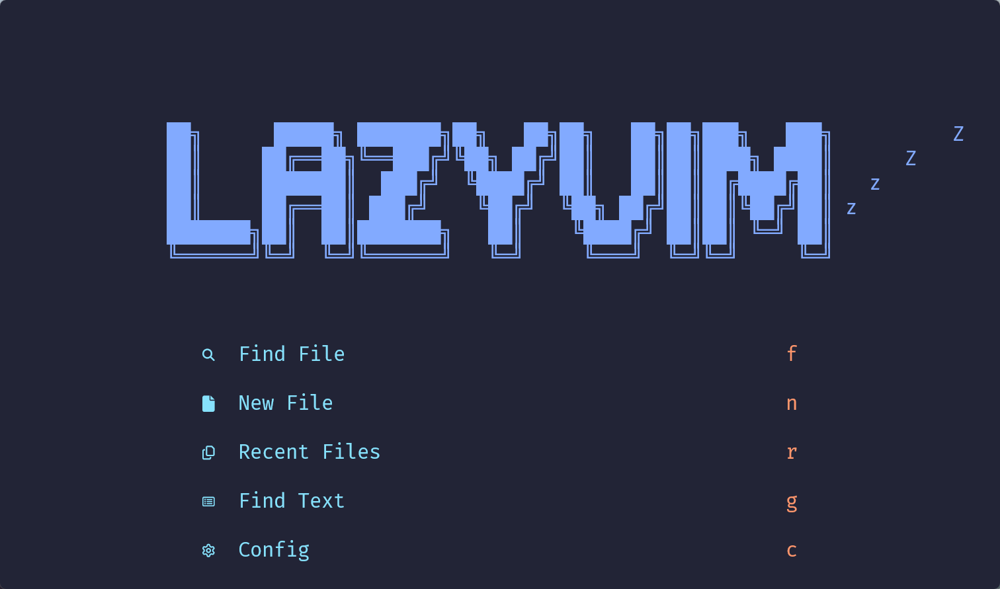
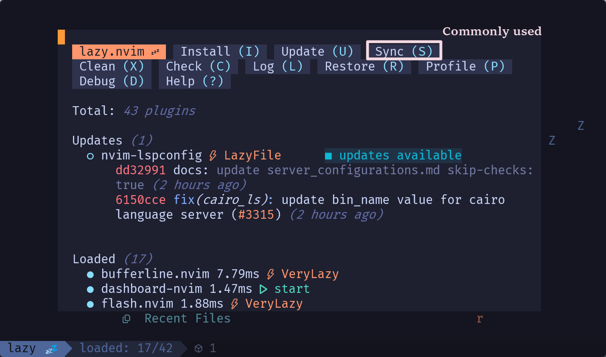
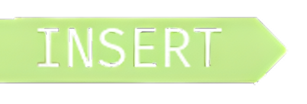
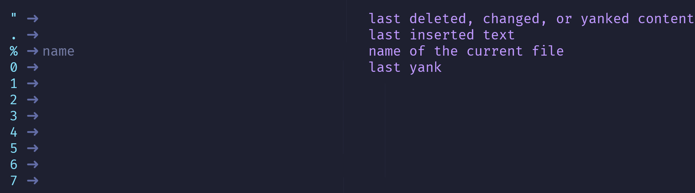
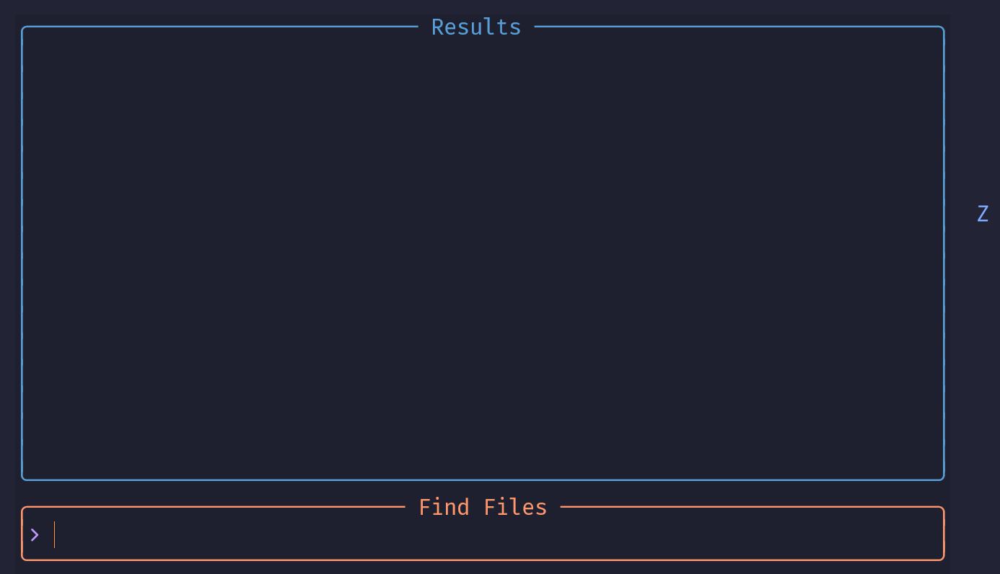
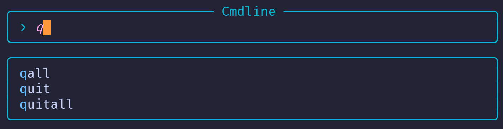

# WSL

### 启用或关闭windows功能


### Network

Add the following to the `C:\Users\<Username>\.wslconfig`

```shell
[wsl2]
networkingMode=mirrored
autoProxy=true
```


## Arch


### Install


[Archwsl](https://github.com/yuk7/ArchWSL/releases)

> Choose
>
> -  ArchWsl-AppX_(version)\_x64.appx
>
> -  ArchWsl-AppX_(version)\_x64.cer
>
>   安装证书 > 本地计算机 > 将所有的证书都放在下列存储 > 浏览 > 受信任的根证书颁发机构 > 安装

​	

### Set password🔐

```shell
passwd
```


### Create default user


##### Set permissions

```shell
echo "%wheel ALL=(ALL) ALL" > /etc/sudoers.d/wheel
```

- %<user /group> \<host> = (<runas_user>) \<commands>
- `/etc` (configuration directory)
- sudoers.==d== (==d==irectory)


##### Pacman GPG key configuration

```shell
sudo pacman-key --init
sudo pacman-key --populate archlinux
sudo chown -R root:root /etc/pacman.d/gnupg
```

- `pacman` - Package manager
- `-R` (recursive)
- `/gnupg` - GNU Privacy Guard


##### Modify Mirror Sources

```shell
echo -e "Server = https://mirrors.tuna.tsinghua.edu.cn/archlinux/\$repo/os/\$arch\nServer = http://mirrors.aliyun.com/archlinux/\$repo/os/\$arch\nServer = https://mirrors.ustc.edu.cn/archlinux/\$repo/os/\$arch" | sudo tee /etc/pacman.d/mirrorlist > /dev/null && sudo pacman -Syyu
```

- `-e` (enable)
  - Enable escape characters

- `tee`

  i.e. Split flow

- `/dev/null`

  - Like a **black hole**
  
    It accept all input but returns nothing 
  
- `-Syyu`

  - `S` (Sync)
  - `yy` - Refresh
  - `u` (Upgrade)

 


##### Add user

```shell
useradd -m -G wheel -s /bin/bash vladelaina && passwd vladelaina
```


##### zsh

```zsh
sudo pacman -S zsh && chsh -s /bin/zsh
```

- Recommend **0**

- `echo $SHELL`

- Delete redundant files

  `rm -f ~/.bash_history ~/.bash_logout ~/.bash_profile ~/.bashrc`


### Tool


```zsh
sudo pacman -Syu && sudo pacman -S neovim git base-devel zsh-syntax-highlighting zsh-autosuggestions mingw-w64-gcc && \
git config --global user.name "vladelaina" && git config --global user.email "vladelaina@gmail.com" && \
echo 'source /usr/share/zsh/plugins/zsh-syntax-highlighting/zsh-syntax-highlighting.zsh' >> ~/.zshrc && \
echo 'source /usr/share/zsh/plugins/zsh-autosuggestions/zsh-autosuggestions.zsh' >> ~/.zshrc && \
curl -sS https://starship.rs/install.sh | sh && \
echo 'eval "$(starship init zsh)"' >> ~/.zshrc && \
echo 'alias i="nvim"' >> ~/.zshrc && \
echo 'alias c="cc"' >> ~/.zshrc && \
echo 'alias wc="x86_64-w64-mingw32-gcc"' >> ~/.zshrc && \
echo 'alias e="explorer.exe"' >> ~/.zshrc && \
echo 'wc() { x86_64-w64-mingw32-gcc "$1" -o "/mnt/c/Users/vladelaina/Desktop/${2}.exe"; }' >> ~/.zshrc && \
source ~/.zshrc
```

- `neovim` `git` `Zsh plug-in`(zsh-autosuggestions , zsh-syntax-highlighting ) `Starship`


nvim

```
rm -rf ~/.config/nivm
rm -rf ~/.local/share/nvim
rm -rf ~/.local/state/nivm
rm -rf ~/.cache/nvim
git clone https://github.com/LazyVim/starter ~/.config/nvim
rm -rf ~/.config/nvim/.git
/opt/nvim/nvim.appimage
```


***

## Ubuntu


### Install


###### renew

```shell
wsl --update
```


###### View installable

```shell
wsl -l -o
```

- `-o` online


###### Install

```shell
wsl --install Ubuntu-24.04 --web-download
			  VersionName	  
```


###### Uninstall

```shell
wsl --unregister VersionName
```


###### Start up

```shell
wsl -d VersionName	/	wsl 
```


###### Close restart

```shell
wsl --shutdown
```


###### Test

```shell
curl google.com
```


### Linux

```shell
sudo apt update
sudo apt install gcc
sudo apt install git 
```

```shell
sudo apt full-upgrade -y
```

- Automatically upgrade all upgradable packages and handle changes in dependedcies


#### [Zsh](https://github.com/zsh-users/zsh)

```bash
sudo apt update
sudo apt install zsh
chsh -s $(which zsh)
```

- It is recommended to choose `0` after restarting


```lua
echo -e '\n# 设置代理\nexport http_proxy="http://127.0.0.1:10808"\nexport https_proxy="http://127.0.0.1:10808"\nexport all_proxy="socks5://127.0.0.1:1080"\n\n# 设置别名\nalias vi="/opt/nvim/nvim.appimage"\nalias te="vi /home/vladelaina/code/test/test.c"\nalias tea="/home/vladelaina/code/test/test"' >> ~/.zshrc && source ~/.zshrc && chmod -x /home/vladelaina/code/test/test
```


######  Using a proxy server

```bash
echo -e 'export http_proxy="http://127.0.0.1:10808"\nexport https_proxy="http://127.0.0.1:10808"\nexport all_proxy="socks5://127.0.0.1:1080"' >> ~/.zshrc && source ~/.zshrc
```

所以，`-e` 是“enable”的缩写，表示启用转义字符的功能。


#### [Starship](https://starship.rs/)

```shell
curl -sS https://starship.rs/install.sh | sh && echo 'eval "$(starship init zsh)"' >> ~/.zshrc && source ~/.zshrc
```


###### Recommended [Configure](https://starship.rs/presets)

```toml
starship preset no-runtime-versions -o ~/.config/starship.toml
```

- Configuration file location 

  `~/.config/starship.toml`


### syntax-highlighting & autosuggestions

```shell
sudo apt install zsh-syntax-highlighting zsh-autosuggestions
```


End of ~/.zshrc

```shell
source /usr/share/zsh-syntax-highlighting/zsh-syntax-highlighting.zsh
source /usr/share/zsh-autosuggestions/zsh-autosuggestions.zsh
```

```shell
source ~/.zshrc 
```


### 🌳[Tree-sitter](https://tree-sitter.github.io/tree-sitter/)


#### 🛠️Install


##### Nodejs & npm

```bash
sudo apt-get update
```


```bash
sudo apt install nodejs npm
```

-  (Node Package Manager) is the package management tool for **<u>Node.js</u>**

-  
  - Is a common dependency that uses **<u>Tree-sitter CLI</u>**
  - A tool for developing web applications and services using **<u>JavaScript</u>** on the server

   

   ```bash
   node -v
   npm -v
   ```


######  Using a proxy server

```bash
    npm config set proxy http://127.0.0.1:10809
    npm config set https-proxy http://127.0.0.1:10809
```


##### tree-sitter-cli

```bash
sudo npm install -g tree-sitter-cli
```


```bash
tree-sitter --version
```


```bash
touch ~/.config/nvim/lua/plugins/treesitter.lua
```

1. **在新文件中添加插件配置**：
   - 打开 `treesitter.lua` 文件，并添加以下内容：

     ```lua
     return {
       "nvim-treesitter/nvim-treesitter",
       run = ':TSUpdate',  -- 自动更新语言解析器
       config = function()
         require'nvim-treesitter.configs'.setup {
           ensure_installed = {"c", "lua", "python"}, -- 在这里指定你需要的语言
           highlight = {
             enable = true,              -- 开启高亮功能
           },
         }
       end,
     }
     ```


```
{ import = "plugins.treesitter" },
```

1. 

2. **在主插件配置中引入新的配置文件**：

   - 在 `~/.config/nvim/lua/config/lazy.lua` 中，修改 `spec` 部分以引入你刚刚创建的 `treesitter.lua` 文件：

     ```lua
     require("lazy").setup({
       spec = {
         { "LazyVim/LazyVim", import = "lazyvim.plugins" },
         { import = "plugins.treesitter" },  -- 引入 Tree-sitter 配置
         { import = "plugins" },  -- 引入其他插件配置
       },
       -- 其他配置...
     })
     ```

3. **保存并重启 Neovim**：
   - 保存所有修改并重启 Neovim。

4. **安装语言解析器**：
   - 在 Neovim 中运行命令来安装你需要的语言解析器：

     ```bash
     :TSInstall c
     ```


Add to init.lua

```lua
require('plugins.treesitter')
```


*****


# Wezterm


## Configuration


> It will automatically reload, and can manually reload it using `CTRL+SHIF+R`

- Locaton

  `$HOME/.config/wezterm/wezterm.lua`


### Fonts


[JetBrains Mono](https://www.jetbrains.com/lp/mono/)


[Nerd-fonts](https://github.com/ryanoasis/nerd-fonts/releases/tag/v3.2.1)

> Recommend	-	[Fira Code](https://www.programmingfonts.org/#firacode)


### Configuration


```lua
local wezterm = require("wezterm")

local config = {
    font_size = 20,
    font = wezterm.font("JetBrains Mono NL", { weight = "Regular" }),
    window_decorations = "RESIZE",
    color_scheme = "Catppuccin Mocha",
    text_background_opacity = 0.8,
    window_background_opacity = 0.8,
    use_fancy_tab_bar = false,
    automatically_reload_config = true,
    hide_tab_bar_if_only_one_tab = true,
    show_new_tab_button_in_tab_bar = false,
    adjust_window_size_when_changing_font_size = false,
    default_cursor_style = "BlinkingBar",
    window_close_confirmation = "NeverPrompt",
    window_padding = {
        left = 35,
        right = 30,
        top = 30,
        bottom = 20,
    },
    background = {
        {
            source = {
                File = "C:\\Users\\" .. os.getenv("USERNAME") .. "\\.config\\wezterm\\1.jpg",
            },
            hsb = {
                hue = 1.0,
                saturation = 1.00,
                brightness = 1,
            },
        },
        {
            source = {
                Color = "#282c35",
            },
            width = "100%",
            height = "100%",
            opacity = 0.55,
        },
    },
    default_prog = { "wsl.exe", "--cd", "/home/vladelaina/code/ch_1/5_characterInputAndOutput" },
    initial_rows = 30,  -- 设置初始行数
    initial_cols = 80,  -- 设置初始列数


}

return config

```


***


# Nvim


### Window


##### cut

- vertical - `:sp`
- level - `:vsp`


****


# 💤[Lazy.vim](https://www.lazyvim.org/)

> Manage plugins & updates
>
> 
>
> `Lazy.nivm` is a plugin for nvim

## 🛠️Installation


###### nvim

```bash
sudo apt install libfuse2
sudo mkdir -p /opt/nvim/
cd /opt/nvim
sudo curl -LO https://github.com/neovim/neovim/releases/download/stable/nvim.appimage
sudo chmod +x nvim.appimage
echo "alias vi='/opt/nvim/nvim.appimage'" >> ~/.zshrc && source ~/.zshrc
```
- The `libfuse2` library is a prerequisite for using `.AppImage` files

- `.AppImage`

    Is a portable application format that runs directly after downloading, without the need for installation

- `/opt` (Optional)

   Used to store standalone third-party application packges

- `curl` (Client URL)

   A client tool for interacting with URLs.

   - `L` (location)

     Follow redirects automatically

   - `O` (remote-name)

     Save the file with the remote server's filename.

- `chmod` (change mode)
  - `x` (execute)


###### lazy.vim

```shell
rm -rf ~/.config/nivm
rm -rf ~/.local/share/nvim
rm -rf ~/.local/state/nivm
rm -rf ~/.cache/nvim
git clone https://github.com/LazyVim/starter ~/.config/nvim
rm -rf ~/.config/nvim/.git
/opt/nvim/nvim.appimage
```


Compile c with one click

```lua
echo -e "vim.api.nvim_set_keymap('n', '<F5>', ':!gcc % -o %< && ./%< <CR>', { noremap = true, silent = true })\nvim.api.nvim_set_keymap('i', '<F5>', '<Esc>:!gcc % -o %< && ./%< <CR>', { noremap = true, silent = true })" >> ~/.config/nvim/init.lua
```


## Configuration


### Dependencies


##### [lazygit](https://github.com/jesseduffield/lazygit?tab=readme-ov-file)


> Simple terminal UI for git commands


###### Install

```bash
LAZYGIT_VERSION=$(curl -s "https://api.github.com/repos/jesseduffield/lazygit/releases/latest" | grep -Po '"tag_name": "v\K[^"]*')
curl -Lo lazygit.tar.gz "https://github.com/jesseduffield/lazygit/releases/latest/download/lazygit_${LAZYGIT_VERSION}_Linux_x86_64.tar.gz"
tar xf lazygit.tar.gz lazygit
sudo install lazygit /usr/local/bin
```


```bash
lazygit --version
```


##### [Ripgrep](https://github.com/BurntSushi/ripgrep)

> Super fast ==text search== tool the respects `.gitignore` by default


###### Install

```bash
curl -LO https://github.com/BurntSushi/ripgrep/releases/download/14.1.0/ripgrep_14.1.0-1_amd64.deb
sudo dpkg -i ripgrep_14.1.0-1_amd64.deb
```


```bash
rg --version
```


##### fd   

> ==File search== tool with a more user-friendly syntax than `find`


###### Install

```bash
sudo apt install fd-find
```


```bash
fdfind --version
```


## Use Starter Repo

```bash
git clone https://github.com/LazyVim/starter ~/.config/nvim
rm -rf ~/.config/nvim/.git
```


#### Doshboard


##### `nvim`




##### Plugin manager


###### Start up

>   -  `<Space> l`
>
>   
>
>   - `nvim l` 
>
>     
>
>   
>
>   -  `:Lazy`
>
>     



- `Sync(S)` - Synchronization

  Equivalent to running **install**, **cleanup**, and **update** simultaneously


****


##  Modal Editing

> Each ==mode== allows for ==specific operations==


### Introduction


**clipboard**(i.e. “Registers” mini-mode) 	

- `Ctrl-r`(in )
- `"` (in ) 



- Paste: `Ctrl-r` followed by the `+`
- In mode, `Ctrl-r` is used to “**redo**”(i.e. undo an undo)


> p	put	paste
>


I i	$\Longleftrightarrow$	aA

gi(the last place)


O

o


Visual Mode


Find Files



- Double click on the space
- <space> ff


#### Command mode

> Work in Insert mode also work in Command mode(include `Ctrl-r` to paste)


q!


:wq = :x


:w file.name

> will save the file with the given name


`:e` or `:edit`

> Open on filesystem
>
> 
>
> `:e foo/baz/fizz.txt`		-	Open the `fizz.txt` file
>
> - Can use ==Tab== completion
>
>   > :e ==/==<Tab>f<Tab>b<Tab>f<Tab>

```bash
/
└── foo
    ├── bar
    └── baz
    │   └── fizz.txt
```


`TAB`	-	competion



- Use ⬅/➡ to move the cursor Up/Down

- **Suggest** using ==Tab== and ==Shift-Tab== to select different entries from the menu


