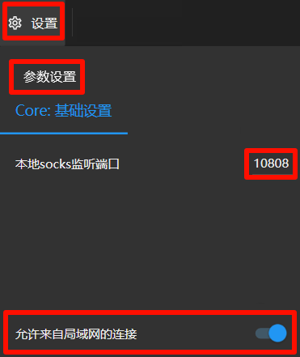

# WSL

### 启用或关闭windows功能


### Install


###### renew

```shell
wsl --update
```


###### View installable

```shell
wsl -l -o
```

- `-o` online


###### Install

```shell
wsl --install VersionName --web-download
```


###### Uninstall

```shell
wsl --unregister VersionName
```


###### Start up

```shell
wsl -d VersionName	/	wsl 
```


###### Network

To `.bashrc`

```shell
host_ip=$(cat /etc/resolv.conf | grep "nameserver" | cut -f 2 -d " ")
export ALL_PROXY="http://$host_ip:10809"
```





### Linux

```shell
sudo apt update
sudo apt install gcc
sudo apt install git 
sudo apt install neovim
```


###### [	(https://starship.rs/)

```shell
curl -sS https://starship.rs/install.sh | sh
```


Add the following to the end of ~/.bashrc

```shell
eval "$(starship init bash)" 
```

```shell
source ~/.bashrc 
```


# Wezterm


## Configuration


> It will automatically reload, and can manually reload it using `CTRL+SHIF+R`

- Locaton

  `$HOME/.config/wezterm/wezterm.lua`


### Fonts


[JetBrains Mono](https://www.jetbrains.com/lp/mono/)


[Nerd-fonts](https://github.com/ryanoasis/nerd-fonts/releases/tag/v3.2.1)

> Recommend	-	[GO-Mono](https://www.programmingfonts.org/#go-mono)


### Configuration


```lua
local wezterm = require("wezterm")

local config = {
    font_size = 20,
    
    -- Using a regular weight font
    font = wezterm.font("JetBrains Mono NL", { weight = "Regular" }),
    
    -- Allow dragging the edges to resize
    window_decorations = "RESIZE",
    
    
    color_scheme = "Catppuccin Mocha",
    
    -- opacity
    text_background_opacity = 0.8,
    window_background_opacity = 0.8,
    
      
    use_fancy_tab_bar = false,
    automatically_reload_config = true,
    hide_tab_bar_if_only_one_tab = true,
    show_new_tab_button_in_tab_bar = false,
    adjust_window_size_when_changing_font_size = false,
    
    default_cursor_style = "BlinkingBar",
    window_close_confirmation = "NeverPrompt",
    
    window_padding = {	-- The distance between the content and the windows edges
        left = 20,
        right = 20,
        top = 20,
        bottom = 5,
    },
    
    background = {
    {
      source = {
        File = "C:\\Users\\" .. os.getenv("USERNAME") .. "\\.config\\wezterm\\dark-desert.jpg",
      },
      hsb = {
        hue = 1.0,
        saturation = 1.00,
        brightness = 1,
      },
    },
    {
      source = {
        Color = "#282c35",
      },
      width = "100%",
      height = "100%",
      opacity = 0.55,
    },
  },
    initial_rows = 150,  
    initial_cols = 90, 
}

return config

```


# Nvim
