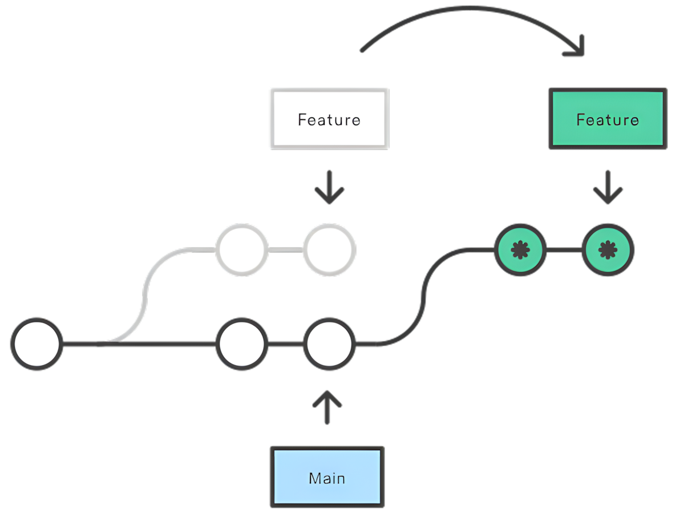

#  Install

```bash
apt install git
```

> apt	Advanced Package Tool	高级包管理工具


*****


# initialization

Set ==username==, ==useremail==, ==DefaoltBranchName== 

```bash
git config --global user.name "Your Name"
git config --global user.email email@gmail.com
git config --global credential.helper store
git config --global init.defaultBranch main
```

> global				Take effect in **all Git operations** of the user
>
> credential.helper	凭据助手
>
> store				 储存
>
> // If there are spaces, use `“”`

- If you want to chang it, just use it again.


View information 

```bash
git config --global -l
```


****


# New

> 仓库	Repository	Repo


## **本地**仓库


### 初始本地仓库

```bash
git init [目录名字]
//不加默认是当前文件
```


### `.git`

> 存放了**Git仓库**的所有数据，删除❌后不再有这个仓库


###  文件

```bash
ls -altr
```

> `-a`	**all**
>
> `-l`	**long**
>
> `-t`	**time**	    **最后**修改时间排序
>
> `-r`	**reverse**	逆序	最新的在**最后面**


****


## **远程**仓库


```bash
git clone <url>
```


******


# Area


### **工作**区

> Working Directory	
>
> 
>
> > **编辑** 和 **修改文件** 的地方


$\Downarrow$	`git add <file> / *.txt / .` 			$\Uparrow$	`git rm --cached <file>`

​			添加快照								  	     remove   已缓存


### **暂存**区

>Staging Area / Index(索引)		一般**存放**在`.git/index`中
>
>
>
>```bash
>git ls-files
>```
>
>> **临时**存储区域，用于保存**准备**提交到 Git仓库的修改内容


$\Downarrow$ 	`git commit / -am "tip"`		( -a  将==已追踪==的文件从  $\Longrightarrow$)

​						all [message](#message)		


### **本地**仓库

> Local Repository
>
> > 通过 `git init` 创建的仓库，存放项目 **版本信息** 和 **代码历史**


`git log`	/	`git log --oneline`(一行精简显示)			查看提交**日志**

> 
>
> > 头文件/当前指针	$\longrightarrow$ 	主分支
> >
> > 嘿，你现在正在 **主分支** 上工作，所有的操作都会影响这个 **主分支**(**指挥棒**)


### Replenish


#### <a id="message">-m</a>

> **开头**以一条简短的（≤50个字符）描述变化，
>
> 然后是一条==空行==，
>
> 然后是**更详细**的描述。

###### 多行备注

```bash
git commit -m "First line" -m "" -m "Third line"
```


###### 所有

```bash
git log -p		#关注提交的代码的的具体更改

p - patch(补丁)
```


```bash
git log --stat --summaty	#了解提交影响及其变化概括
		  统计     摘要
```


###  Tag - 设置标签

> 用于标记==特定的提交== ，用于**标识**发布的**版本** || 重要的**里程碑**


#### 创建标签

```bash
git tag <version> <ID>		#后面可以使用标签代替<ID>
```

- <version> 通常是**版本号**，e.g. `1.0.0` - `主版本号.次版本.补丁号`


##### 版本

> `1.0.0-alpha`	`2.0.0-bata`	`3.0.0-rc1`


###### alpha

> 初步测试版本 ，功能未完善，可能存在很多的问题


###### bata

> 功能相对完善，但仍有可能存在问题


###### rc

> (Release Candidate) 候选版本，接近正式版，如果没有严重的BUG将作为正式版发布


#### 提交的同时创建

```bash
git commit -m "Submit message" && git tag <version>
```

- `&&` **逻辑与**：前一个命令**成功执行后**，**才会执行**后一个


****


# State

```bash
git status {-s}		# s - short
```

> 
>
> 
>
> 
>
> ==??==	**U**ntracked	未追踪
>
> ==M== 	**M**odified	 已**修改**
>
> ==A==  	**A**dded	    已添加到**暂存区**
>
> ==D==	 **D**eleted	   已**删除**
>
> ==R==	 **R**enamed	 重命名
>
> ==U==	 **U**pdated	  已更新未合并


### Untrack - 未跟踪

> 新创建，未被Git管理


$\Downarrow$ 	`git add .`


### Unmodified - 未修改

> 已管理，未修改


$\Downarrow$ 


### Modified -  已修改

> 已修改，但未添加到**暂存区**


$\Downarrow$ 


### Staged - 已暂存

> 修改后，添加已到**暂存区**


******


# 搜索


### 字符串

```bash
git grep "strings" <file.name>/<ID>	
#省略后面的，则会搜索它所管理的当前目录中的任何文件
```

- `grep` - global regular exprssion print(全局正则表达式打印)

  根据给定的==正则表达式==或==字符串模式==


****


# 恢复

> `HEAD^`表示**上一个版本**


### Revert - 还原

```bash
git revert <ID>
```

- 创建一个新的**提交**来回退


### Reset - 回退

```bash
git reset --soft / --mixed / --hard <ID>
```

- `soft`    -    所有修改仍会保留
- `mixed`  -    退回这来，不追踪(默认)
- `hard`    -    会删除后面的提交跟修改，**彻底回退**


******


# Compare


## 三个区域


### 工作区 - 暂存区


> ```bash
> git diff	#差异
> ```

```bash
$ git diff
diff --git a/3.txt b/3.txt      # 比较文件 `3.txt` 的两个版本
index 55bd0ac..1e6fd03 100644   # 旧..新 文件权限(普通文件)
--- a/3.txt                     # 旧版本
+++ b/3.txt                     # 新版本
@@ -1,2 +1,3 @@                 # 旧文件(1-2行),新文件(1-3行)
-333    # 旧版本内容
+444    # 新版本内容
```


### 工作区 - 本地仓库

 ```bash
 git diff HEAD	# HEAD - 指向分支最新提交节点
 ```


### 暂存区 - 本地仓库

 ```bash
 git diff --cached	#cached - 已暂存
 ```


### 本地仓库 - 远程仓库

```bash
git diff origin/main main
```


## **版本**


### 不同版本

```bash
git diff <ID₁> <ID₂>
```


> HEAD				 最新的提交
>
> HEAD**^** / HEAD**~**	上一个版本
>
> HEAS~<n>     	   上<n>个版本


### 只查看文件的差异

```bash
git diff <ID₁> <ID₂> <fileName>
```


****


#  LOG Gitk Diff Show


### log

> 只能==顺序显示提交==，**分支分叉**和**合并**时顺序可能**混乱**


```bash
git log <ID₁>..<ID₂>	#between
git log <ID₁>..			#从<ID₁>开始(不包括)，到当前分支
```


##### 自特定时间以来

```bash
git log --since="2 weeks age"
			   ="1 hour age"
			   ="1 hour 30minutes ago"
			   ="1 day ago"		
			   ="2024-09-19"
```


###### 只跟踪某一文件

```bash
git log <ID>..<FileName> 
```

> 查看自<ID>以来，文件<FileName>的变更记录


##### 一个分支相对另一个分支的新提交

```bash
git log <基准分支>..<目标分支>
```

- 显示**目标分支**中有但**基准分支**中没有的==提交==


##### log -p

```bash
git log -p HEAD..FETCH_HEAD	 	#显示FETCH_HEAD的改动
```

- 提交日记及具体的**文件改动**(`-p` - patch)
- `..` $\Longrightarrow$ `...`        从**共同祖先**到各自的差异


### gitk

> ```bash
> sudo apt install gitk
> ```
>
> 在==可视化历史==方面更好


#### 比较提交

```bash
gitk <ID₁> <ID₂>
```


#### 与`FETCH_HEAD`比较


##### ..

```bash
gitk HEAD..FETCH_HEAD
```

- 比较差异


##### ...

```bash
gitk HEAD...FETCH_HEAD
```

- 共同祖先到各自的差异


#### 指定==目录==&==时间==

```bash
gitk --since ="2 weeks age"	<Directory_Name>/
			 ="1 hour age"
			 ="1 hour 30minutes ago"
			 ="1 day ago"		
		     ="2024-09-19"
```


### diff

 

```bash
git diff HEAD..FETCH_HEAD		
```

- 仅显示**内容**变化


#### 比较==两个==文件的==不同版本==

```bash
git diff <ID¹>:<File.Name¹> <ID²>:<File.Name²>
```

- 比较<u>同一文件</u>或<u>不同文件</u>在**不同版本中**的差异


### show


##### 指定

```bash
git show <ID>
git show <Branch_name>
```

​	

##### 指定文件指定版本

```bash
git show <ID>:<File.Name>
```


##### **单个**父提交

```bash
git show HEAD^				#parent
git show HEAD^^				#grandparent
git show HEAD~4				#great-great grandparent
```


##### **多个**父提交 - 合并提交

```bash
git show HEAD^1 	# 第1个父提交 = HEAD^
git show HEAD^2 	# 第2个父提交
```

****


# 文件操作


### 删除


#### M_1

```bash
git rm <file.name>				# 工作区 ＆ 暂存区
git commit -m "delet file.name" # 提交到本地仓库

git rm --catched <file.name> 	# 版本库
```


#### M_2

```bash
rm <file.name>
git add <file.name> / .			#更新到 暂存区
```


### 恢复


#### 未提交时

```bash
git restore <file.name>
	恢复
```


#### 已添加到暂存区

```bash
git restore  --staged <file.name>
git restore <file.name>
```


#### 已提交


##### 恢复到**工作目录**跟**暂存区**

```bash
git checkout <ID> -- <file.name>
	检出
```


##### 恢复到工作目录

```bash
git restore --source=<ID> --staged --worktree <file.name>
	恢复				       恢复
```


*****


# .gitignore

> .git<font color="FFAAB">ignore</font>  忽略
>
> **忽略**一些不应该被加入到 **版本库** 中的文件

 

### 忽略原则

- **系统** 或 如 **软件** **自动生成**的文件

- 编译生成的**中间文件** 或 **可执行文件**

  > e.g.  Java 编译生成的 `.class` 文件，C 编译生成的 `.o` 文件

- 运行时**自动生成**的文件

  > 日志文件`.log`、缓存文件、临时文件

- 包含**敏感信息**的配置文件

  > 用户名、密码、Token 


### add


###### file

```bash
echo <file.name> > .gitignore	# echo(回响)

echo *.log >> .gitignore		#忽略所有的 日志文件
```

> 查看**被管理**的的文件	`git ls-files`


###### folder

```bash
echo <folder.name>/ 
```


### [匹配规则](https://git-scm.com/docs/gitignore) $\downarrow$


#### 注释

> 空行 &  `#` 开头


#### Blob模式匹配

> Binary Large Object	二进制大对象
>
> 在一大块数据中找到符合特定特征的部分


##### *

> 任意个 char  
>
> 
>
>  `*.log`			e.g.    `1.log` `2.log`


##### !

> 排除
>
> `!access.log`	追踪文件，即使前面忽略了 `.log`


##### ?

> **单个**字符       `a?.txt`              e.g.    `a1.txt` `a2.txt`


##### [ ]

> 字符**集合**	`[abc]`		e.g.  `a/b/c`
>
> 
>
> 可以使用`-` 
>
> [0-9]	任意一个数字
>
> [a-z]	 任意一位小写字母


##### **

> 任意中间目录
>
> 
>
> /home/ <font color="FFAAB">**</font>/a.txt
>
> ⬇ (可以匹配)
>
> /home/ <font color="FFAAB">user/docs</font>/a.txt


##### /


###### forward

> `/Document`
>
> 
>
> 仅忽略当前目录下的==文件==


###### back

> `Folder/`
>
> 
>
> 仅忽略当前目录下的==文件夹==
>
> `document`


*****


# TO Github


### [SSH](https://docs.github.com/zh/authentication)

> Secure Shell


#### 生成密钥对

```
ssh-keygen
```

- `keygen`	-	key **generator**(生成密钥的工具)
- Location:  `/root/.ssh`


#### 配置Github公钥

> `.pub`


#### 测试连接

```bash
ssh -T git@github.com
```

- `-T`	-	`--no-tty`	-	`--no-teletypewriter`  不需要交互式终端支持


### 初始化

```bash
git init
git add .
```


###  关联

```bash
git remote add origin <url>			#设置别名为origin
```

> remote	-	远程
>
> origin	 -	 原始
>
> 
>
> 可以添加多个仓库


###### Replenish

```bash
git remote -v		 #查看的远程仓库信息
git remote set-url origin <new_URL>		#关联系新的URL
```


### 主分支重命名

```
git branch -M main
```

> -M	-	--move


### Pull - 拉取

```bash
git pull <远程仓库名> < 远程分支名>:<本地分支名> --rebase	
		   origin             main
#可以直接用 git pull
```

- `--rebase`	-	重新基准

  > 让**本地更改**排在**远程更改**==后==


### Push - 推送

```bash
git push -u <远程仓库名> <本地分支名>
			  origin     main
```

- `-u` - 设置上游分支 (upstream branch)

  > 之后可直接使用 `git push` || `git pull`


### 修改推送的注释

```bash
git commit --amend -m "……"		#amend - 修正
```

​	

​	


****


# Branch


### 列出分支


###### 本地

```bash
git branch
```

- \*  当前分支	 


###### 远程

```bash
git branch -r
```

- `-r`	remote branch


### 提交

> <branch_name>:\<number>


### 创建

#### 正常创建

```bash
git branch <Branch_Name>
```


#### 创建并切换

```bash
git checkout -b <Branch_Name> {<ID>}
	切换		 branch
```

- `<branch_name>`
  - `dev`       development(开发)    开发的**主分支**
  - `feat`      feature (特点)          开发**特定功能**
  - `stable`   **稳定**分支，通常用于发布                             
- `<ID>`    -    以其为基础


### -d - 删除

```bash
git branch -d <branch_name>
		   -D				# 如果没有合并
```


### Switch - 切换

#### M_1


```bash
git switch <branch_name>
```


#### M_2

```bash
git checkout <branch_name>
	 切换
```

- `git checkout` 还可以**恢复**文件或目录**到之前的状态**
- 如果分支名称与文件**名称相同**，默认切换分支，**容易出现歧义**


#### M_3

```bash
git checkout -b <branch_name> <ID>
	  切换	--branch
```

> ==创建==并==切换==到 以指定提交`<ID>`为起点的`<branch_name>`==新分支==


### Merge - 合并

```bash
git merge <branch_name>
	 合并
```

- ==当前分支==就是合并的**默认分支**


### Rebase - 变基

> 可以将提交**线性化**，最终形成一条==直线==的提交历史

```bash
git rebase <branch_name>
```

> 
>
> - refs - references(参考文献)


```bash
* Feature	
git rebase Main			#当前 -> 目标分支
```




### Fetch - 获取

> 获取最新的货物清单，但不立刻卸货


##### 获取更新

```bash
git fetch <URL> <Remote branch name>
```

- 并不会自动整合到**本地仓库**


##### 查看具体的内容

```bash
git show FETCH_HEAD			#提交日志及其更改
```


##### Prune - 删除

```bash
git fetch --prune
```

- prune - 精简;修剪(树枝的枝叶)


### Graph - 查看分支

```bash
git log --all --oneline --graph --decorate
                                   修饰
```

- 设置别名

  ```bash
  .bashrc		-	.bash run commands
  
  alias graph="git log --all --oneline --graph --decorate"
  
  source ~/.bashrc	-	读取并执行
  ```


****


# 解决合并冲突


### 查看冲突文件的==列表==

```bash
git status
```


### 查看冲突具体==内容==

```bash
git diff
```

- 

    ```bash
    <<<<<<< HEAD
    // 当前分支的代码
    =======
    // 合并进来的代码
    >>>>>>> branch_name
    ```


### 编辑冲突文件

- 保留需要的部分
- 删除 `<<<<<<<`、`=======` 和 `>>>>>>>` 等标记


### 提交

```bash
git commit -am “ Resolved merge conflict”	# 解决合并冲突
```


### 中断合并

```bash
git merge --abort
```


****


# [Store Dotfiles in a bare repository](https://www.atlassian.com/git/tutorials/dotfiles)

> Bare repository: Acts as an ==archive== that doesn’t store actual content but only records ==version information==


## Set


```bash
git init --bare $HOME/.cfg
```

> Used to track files

- `.cfg`	$\Rarr$  `configuration`


```bash
alias config='/usr/bin/git --git-dir=$HOME/.cfg/ --work-tree=$HOME'
```

> Use `config` instead of `git`  	
>
> - e.g.
>
>   - 
>
>     `config remote add origin <git-repo-url>`
>
>     `config push -u origin main`
>
>   
>   
>   - 
>   
>     `config add .vimrc`				$\Rarr$	 	**Just add it directly**
>   
>     `config commit -m "Add vimrc"`
>   
>     `config push`
>   
>     `config status`

- `/usr/bin/git` 

  > Spcify the  **Git executable** path

- `--git-dir=$HOME/.cfg`

  > Specify **metadata location**(The ‘heart🩷 of the repository’) 

  - `dir`	$\Rarr$	`directory`

- `--work tree=$HOME`

  > Specify **working directory**
  >
  > 
  >
  > - Dotfiles basically here


```bash
config config --local status.showUntrackedFiles no
```

> Not show untracked files when run `git status`


```bash
echo "alias config='/usr/bin/git --git-dir=$HOME/.cfg/ --work-tree=$HOME'" >> $HOME/.bashrc
```

> Append to `.bashrc` file


## Installing or Migrating 


### Prepare


##### alias

```bash
alias config='/usr/bin/git --git-dir=$HOME/.cfg/ --work-tree=$HOME'
```

> Make sure to add to `.bashrc` or `.zsh`


##### ignore `.cfg`

```bash
echo ".cfg" >> .gitignore
```

- `.cfg`	$\Rarr$	`configuration`

  Folder that need to be ignored

> Ensure that the content and structure between the **original repository** and the **cloned instance** remain ==independent==


### Pull

```bash
git clone --bare <git-repo-url> $HOME/.cfg
```

> Clone to `.cfg`(bare repository)
>
> 
>
> Only the ==directory  structure==  is cloned, without the actual files.


### Checkout

> ==bare repository==(**content**)	$\Rarr$  ==$HOME==


> ```bash
> config checkout
> ```
>
> Actual execution⬇
>
> ```bash
> git --git-dir=$HOME/.cfg/ --work-tree=$HOME checkout
> ```
>
> - ==Extracting== from the **<u>bare repository</u>** and ==copying== to  `$HOME` directory


#### Backup 

```bash
mkdir -p .config-backup && \
config checkout 2>&1 | egrep "\s+\." | awk {'print $1'} | \
xargs -I{} mv {} .config-backup/{}
```

> Backup confilicting Dotfiles to `.config-backup`

- Execute `config checkout` agin


### Suppress

```bash
config config --local status.showUntrackedFiles no
```

> Not show untracked files when run `git status`


### ==Bootstrap==

```bash
git clone --bare https://github.com/vladelaina/Dotfiles.git $HOME/.cfg
function config {
   /usr/bin/git --git-dir=$HOME/.cfg/ --work-tree=$HOME $@
}
mkdir -p .config-backup
config checkout
if [ $? = 0 ]; then
  echo "Checked out config.";
  else
    echo "Backing up pre-existing dot files.";
    config checkout 2>&1 | egrep "\s+\." | awk {'print $1'} | xargs -I{} mv {} .config-backup/{}
fi;
config checkout
config config status.showUntrackedFiles no
```

> One step in place


****


# Development Process


****


# Official documentation

[Tutorial](https://git-scm.com/docs/gittutorial) -> [Everyday](https://git-scm.com/docs/giteveryday) -> [Documentation](https://git-scm.com/docs/git/en) -> [CLI](https://git-scm.com/docs/gitcli)

> CLI	-	Command Line Interface	命令行界面


###### Come and have a look when you have time

[ATLASSIAN](https://www.atlassian.com/git/glossary#commands)


*****


