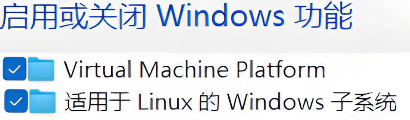

[1](./images)





```bash
sudo apt update
sudo apt install neovim
sudo apt install git		
```


```bash
wsl -l -v
wsl -d Name 	
```


C:\Users\vladelaina\.config\wezterm\wezterm.lua

```bash
local wezterm = require 'wezterm' -- 引入 wezterm 模块

return {
    -- 设置默认域为 WSL:Ubuntu-24.04
    default_domain = 'WSL:Ubuntu-24.04',
}
```

